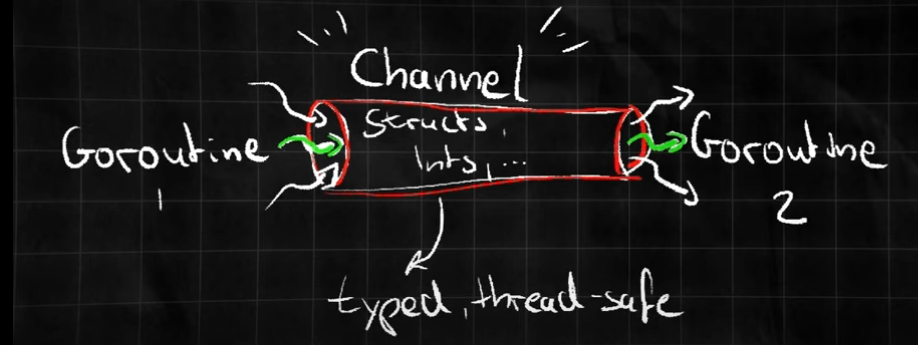

# Go Currency

- Source: [Youtube Videos](https://www.youtube.com/watch?v=y2jP45S9BHk)
- Status: Progress

## WaitGroup

- Used to coordinate multiple Goroutines
- Basically allows you to kind of wait for a collection of Goroutines to kind of finish executing before executing the next step.
- You can really imagine WaitGroup as a somehow as a counter which increments whenever Goroutine start whenever you add
  something to the counter and whenever you say kind of done right it decreases and it is decrements the counter.

## Mutex

- Locking Mechanism that ensures that only one goroutine can access a specific section of your code.
- Prevent Race Condition among goroutine.
- Imagine these Mutex as somehow a traffic light which in the end allows only one car or 
  one specific goroutine in this case to pass through an intersection or a block of code at the time.
- Mutex will make goroutine FIFO (First In First Out) in queue.

## Channels

- Imagine channel like a pipe, this pipe has a specific data type which could be an integer to only like carry
  this sort of data through the pipe and then the data flows through the pipe from one direction to another,
  from sender to the receiver. **It is important that multiple senders and receivers can use the channel but it is
  really important to know that Go ensures that only one operations happens at the time**.

## Select

- Designed for channel operations.
- This Select Statement waits until one of the channel operations which can be sending or receiving data
  becomes ready to execute.
- It can wait on multiple channel operations simultaneously.
- Select statement is a blocking mechanism.
- If The Select Statement have a default case for our Select Statement, then it will waits
  until one channel operation becomes ready for execution. 
- Whenever multiple channels are ready simultaneously, then the Select Statement just select one randomly.
- Common use cases could be timeout handling or event multiplex

